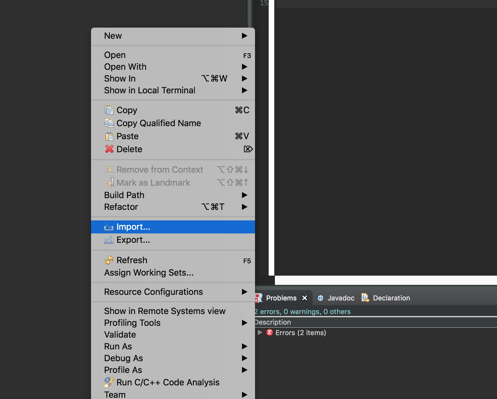

# FRC 1595 code repo
*New programmer, who dis?*

Need to install/clone this repo? See the following instructions

## Installing through github desktop
Click on the option that says: `clone or download` and select `open in desktop`

In the Clone a Repository option, choose where you want to save the repository by click the `Choose...` button, and then selecting the choosing the directory. Then, select `Clone`

To verify that you have cloned the repository successfully, just look in the top left corner, it should display `1595-Code`

Moving to eclipse, in the package explorer, right-click, and select `Import`

For the import wizard, go under `General`, and select `Existing Projects into Workspace`. Then click next

When the options window comes up, select `Select root directory`, and choose where you saved the repository. In the projects window, make sure that 2018-Code is selected, then click finish

## Installing through eclipse